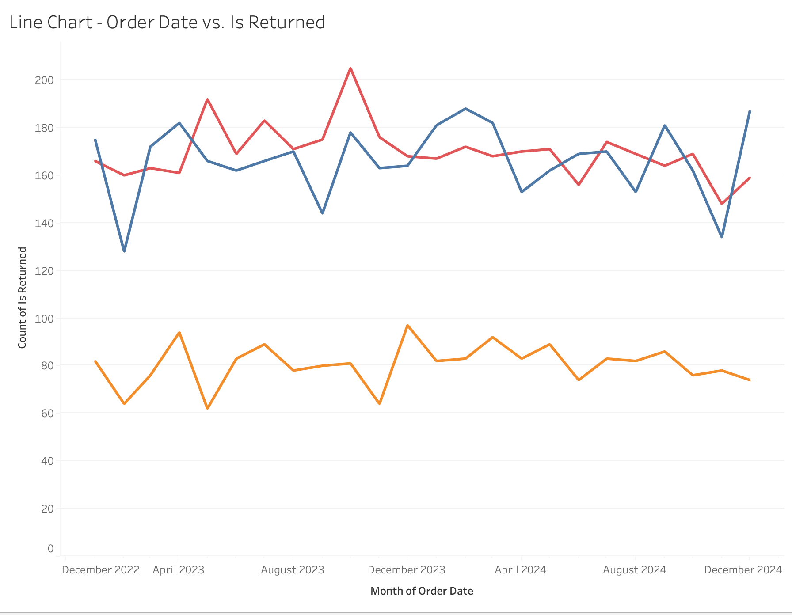
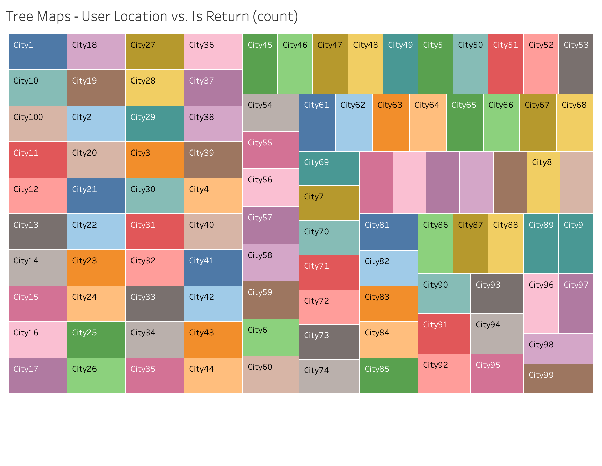
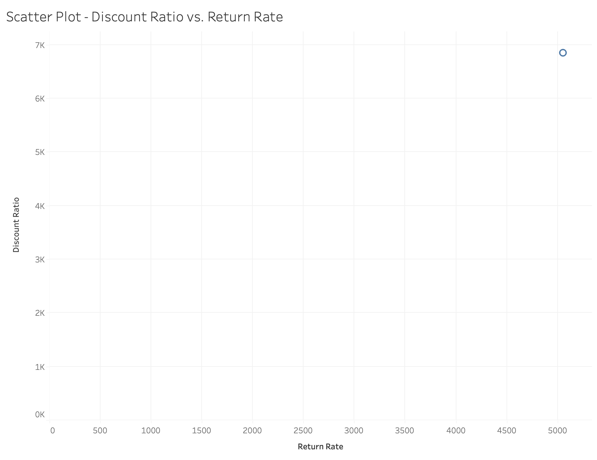
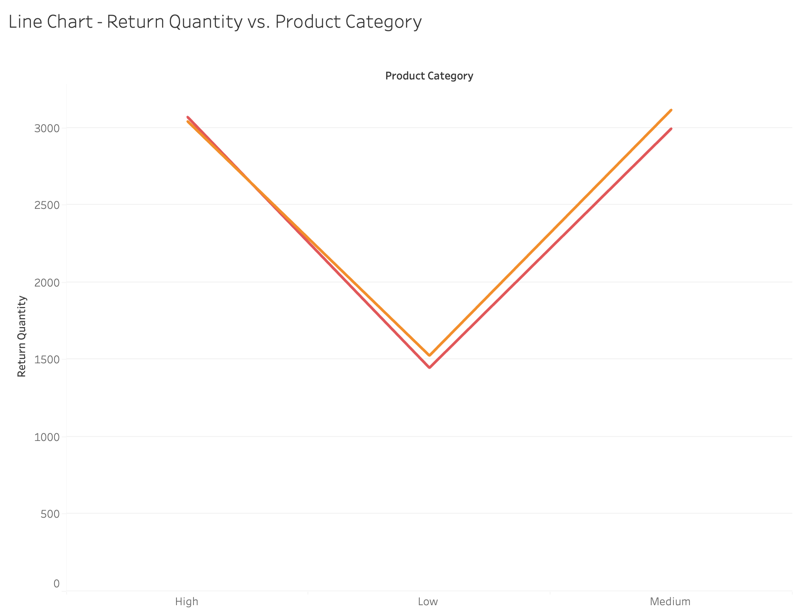

# E-commerce Returns Data Analysis

````markdown

This project provides a comprehensive analysis of a synthetic e-commerce returns dataset. It includes data cleaning, feature engineering, visualization using Python (Seaborn & Matplotlib), and exporting to an SQLite database. A Tableau dashboard is also created for interactive insights.

## Dataset Overview

The dataset used in this project is a synthetic dataset simulating e-commerce transactions and returns. Each row represents an order and contains information such as:

- `Order_ID`: Unique identifier for each order
- `Order_Date`: Date when the order was placed
- `Return_Date`: Date when the item was returned (if applicable)
- `User_Location`: Location of the customer
- `Shipping_Method`: Method used to deliver the product
- `Product_Price`: Price of the product
- `Order_Quantity`: Quantity ordered
- `Discount_Applied`: Discount applied to the product
- `Days_to_Return`: Number of days taken to return the item (if returned)

## Project Workflow

### 1. **Data Loading**
```python
df_return = pd.read_csv("ecommerce_returns_synthetic_data.csv")
````

### 2. **Initial Exploration**

* Used `.head()`, `.info()`, and `.describe()` for overview
* Missing values identified with `.isna().sum()`

### 3. **Feature Engineering**

* `Return_Quantity`: Based on presence of `Return_Date`
* Converted `Order_Date`, `Return_Date` to datetime
* Cast numerical columns using `Int64`
* Added `Is_Returned`, `Return_Rate`, `Discount_Ratio`, `Product_Category` (binned)

### 4. **Visualization (Python)**

* Return Quantity by Product Category
* Return Quantity by Shipping Method

### 5. **Statistical Aggregations**

* Return rate by `Product_Category` and `Shipping_Method`

### 6. **Database Export**

* Saved to SQLite database (`return.db`)
* SQL dump file (`ecommerce_return_dump.sql`) generated

## Tableau Dashboard

An interactive Tableau dashboard is created for business users and stakeholders to explore return behavior trends.

### Key Charts

| Chart                                   | Description                                             |
| --------------------------------------- | ------------------------------------------------------- |
| **Return Quantity by Product Category** | Total returns per pricing tier                          |
| **Return Quantity by Shipping Method**  | Return frequency per delivery type                      |
| **Return Rate by Product Category**     | Percentage of orders returned across pricing categories |
| **Discount vs. Return Rate**            | Relationship between discount offered and returns       |
| **Returns by User Location**            | Top return-heavy regions                                |
| **Days to Return Distribution**         | Time trends on how long users take to return items      |
| **Monthly Return Trends**               | Seasonality and monthly spikes in returns               |

### Tableau Visualization Analysis

#### 1. Monthly Return Trends


Shows seasonality with peaks around December, likely due to holiday shopping behavior.

#### 2. Days to Return Distribution


Most returns occur within 0–100 days. Outliers suggest possible data quality issues.

#### 3. Returns by User Location


Cities like City18, City36, and City49 show higher return rates — potentially useful for regional strategy.

#### 4. Discount Ratio vs. Return Rate


An upward trend indicates high discounts may encourage more returns.

#### 5. Product Category vs. Return Rate


Certain pricing tiers (e.g., high-end products) exhibit higher average return rates.

#### 6. Shipping Method vs. Return Quantity


Standard shipping leads to more returns, possibly due to slower delivery or customer dissatisfaction.

#### 7. Return Quantity by Product Category


Premium-priced products are returned more often — a key insight for inventory and QA teams.

### Feature Comparisons

| Feature A          | Feature B         | Insight                                     |
| ------------------ | ----------------- | ------------------------------------------- |
| `Shipping_Method`  | `Return_Quantity` | Which shipping methods cause more returns   |
| `Product_Category` | `Is_Returned`     | How product type affects return probability |
| `User_Location`    | `Return_Rate`     | Geo-based customer behavior                 |
| `Discount_Ratio`   | `Return_Rate`     | Impact of discounts on returns              |
| `Order_Quantity`   | `Return_Quantity` | Larger orders returning more?               |

### Setup Steps in Tableau

1. **Export Cleaned Dataset**

   ```python
   df_return.to_csv("cleaned_ecommerce_returns.csv", index=False)
   ```

2. **Import to Tableau**

   * Open Tableau
   * Connect to `cleaned_ecommerce_returns.csv`

3. **Build Sheets and Dashboard**

   * Create calculated fields like `Return Rate` or `Product Category` if needed
   * Use filters and tooltips for better interactivity
   * Combine sheets in one dashboard for a holistic view

## Sample Insights

* Premium products tend to have higher return rates.
* Standard shipping sees the most returns.
* Discount levels alone don’t predict return likelihood.
